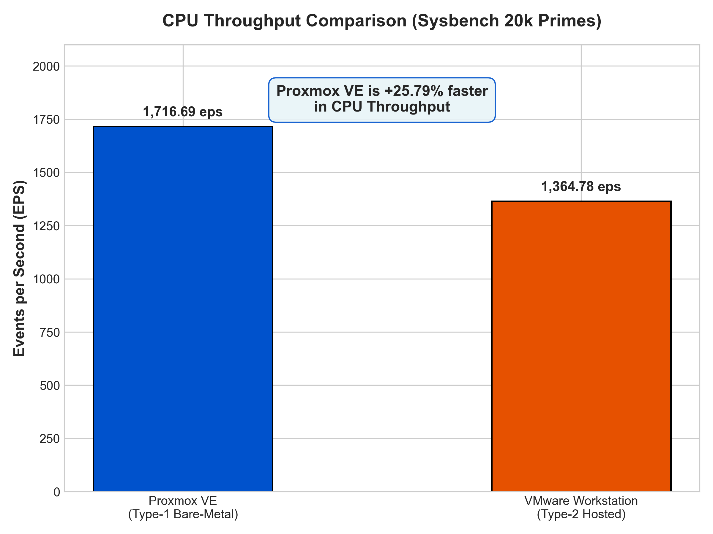

# Cloud Computing – Experiment 1
## CPU Performance Study Using Type-1 and Type-2 Virtualization

This repository contains the work for **Cloud Computing Experiment 1**. The experiment uses the same Ubuntu workload on two different virtualization setups and compares their CPU benchmark behaviour.

The two environments considered are:

- **Proxmox VE** – Type-1 / bare-metal virtualization
- **VMware Workstation** – Type-2 / hosted virtualization

The CPU workload is generated with **Sysbench** using a maximum prime value of `20000`. The comparison focuses on throughput and latency rather than treating one hypervisor as universally faster than the other.

---

## 1. What This Experiment Investigates

The experiment was carried out to observe how the virtualization layer can affect a CPU-bound workload.

The main tasks were:

1. Create an Ubuntu virtual machine on Proxmox VE.
2. Create a comparable Ubuntu virtual machine in VMware Workstation.
3. Keep the important VM resources approximately the same.
4. Run the same Sysbench CPU test in both environments.
5. Record the benchmark output and compare the measurements.
6. Use the results to understand the practical difference between Type-1 and Type-2 virtualization.

---

## 2. Experimental Setup

### Type-1 environment

```text
Physical Computer
       │
       ▼
   Proxmox VE
       │
       ▼
    Ubuntu VM
       │
       ▼
    Sysbench
```

### Type-2 environment

```text
Physical Computer
       │
       ▼
    Windows OS
       │
       ▼
 VMware Workstation
       │
       ▼
    Ubuntu VM
       │
       ▼
    Sysbench
```

The important architectural difference is that VMware Workstation runs on top of a general-purpose host operating system, while Proxmox VE is installed directly on the machine and uses KVM-based virtualization.

---

## 3. VM Configuration

The two test VMs were configured with comparable resources so that the benchmark comparison would not be dominated by different VM sizes.

| Configuration | Proxmox VE | VMware Workstation |
|---|---|---|
| Guest OS | Ubuntu 24.04.x 64-bit | Ubuntu Linux 64-bit |
| vCPUs | 2 | 2 |
| Memory | 2 GB | 2 GB |
| Disk | 20 GB | 20 GB |
| CPU workload | Sysbench CPU | Sysbench CPU |
| Prime limit | 20,000 | 20,000 |

Other VM-specific settings such as virtual networking and disk-controller configuration were selected according to the respective hypervisor environment.

---

## 4. Benchmark Procedure

Before running the benchmark, the guest system was checked using common Linux commands:

```bash
hostnamectl
lscpu
free -h
df -h
top
```

Sysbench was installed with:

```bash
sudo apt update
sudo apt install sysbench -y
```

The CPU test used for both VMs was:

```bash
sysbench cpu --cpu-max-prime=20000 run
```

The same benchmark command was used in both environments to keep the workload consistent.

---

## 5. Recorded Results

The benchmark runs produced the following measurements:

| Metric | Proxmox VE | VMware Workstation |
|---|---:|---:|
| Run time | 10.0004 s | 10.0007 s |
| Total events | 17,169 | 13,650 |
| Events/sec | 1,716.69 | 1,364.78 |
| Minimum latency | 0.57 ms | 0.67 ms |
| Average latency | 0.58 ms | 0.73 ms |
| 95th percentile latency | 0.65 ms | 0.89 ms |
| Maximum latency | 2.78 ms | 4.06 ms |

### Throughput observation

For this particular run, the Proxmox VM completed more CPU events during the fixed benchmark interval. The difference in events per second was:

```text
1716.69 - 1364.78 = 351.91 events/sec
```

This corresponds to approximately **25.8% higher measured throughput relative to the VMware result**.

### Latency observation

The measured average latency was lower in the Proxmox run. The 95th-percentile and maximum values also show a difference between the two test environments.

These values describe this experiment and configuration; they should not be interpreted as a universal performance ratio for all Proxmox and VMware installations.

---

## 6. Result Visualizations

### CPU throughput



### Latency measurements


### Total completed events


### Overall view


---

## 7. Interpretation

A few factors can contribute to the difference observed in the benchmark:

- **Virtualization architecture:** Proxmox VE uses KVM and hardware-assisted virtualization, while VMware Workstation operates within the host OS environment.
- **Host scheduling:** A hosted VM shares host resources with the Windows operating system and its background processes.
- **System configuration:** CPU model, power settings, background processes, memory pressure and other host settings can influence benchmark results.
- **Run-to-run variation:** A single benchmark execution is not enough to establish a general performance ranking. Repeating the experiment would provide a stronger statistical comparison.

Therefore, the useful conclusion from this lab is the **measured behaviour of the two configured test environments**, rather than a claim that one virtualization technology is always better.

---

## 8. Repository Contents

```text
CC-Experiment-1/
│
├── README.md
├── LAB_REPORT.md
│
├── images/
│   ├── 1.png
│   ├── 2.png
│   ├── events_per_second_comparison.png
│   ├── latency_comparison.png
│   ├── total_events_comparison.png
│   ├── overall_performance_dashboard.png
│   ├── part 1/
│   └── part 2/
│
└── scripts/
    ├── benchmark.sh
    ├── parse_sysbench.py
    └── generate_plots.py
```

### Script purpose

- `benchmark.sh` – collects system information and runs the CPU benchmark.
- `parse_sysbench.py` – works with the recorded benchmark values and calculates comparisons.
- `generate_plots.py` – generates the performance graphs used in the report.

---

## 9. Reproducing the Test

Inside each Ubuntu VM:

```bash
chmod +x scripts/benchmark.sh
./scripts/benchmark.sh
```

After collecting the required values, the Python scripts can be used to prepare the comparison figures.

```bash
python3 scripts/parse_sysbench.py
python3 scripts/generate_plots.py
```

---

## 10. Learning Outcome

This experiment helped in understanding the practical difference between hosted and bare-metal virtualization. It also provided experience with VM resource configuration, Linux system inspection, CPU benchmarking, result interpretation and presenting experimental data using Python-generated graphs.

---

**Course:** Cloud Computing / Computer Networks Laboratory  
**Experiment:** 1 – Virtual Machine Performance Comparison
